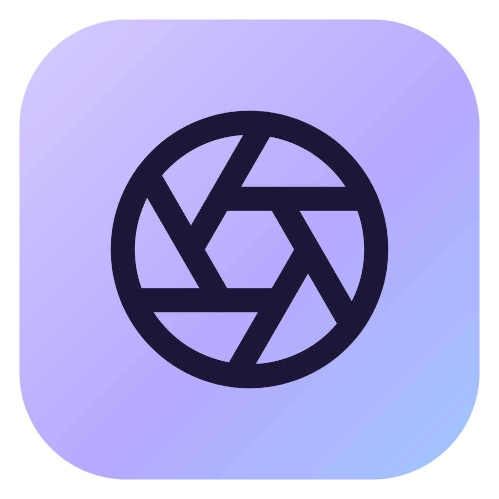
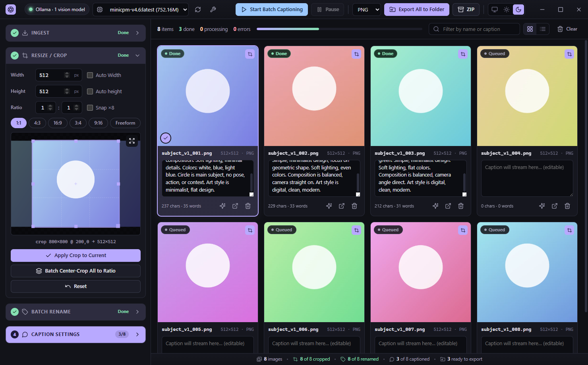
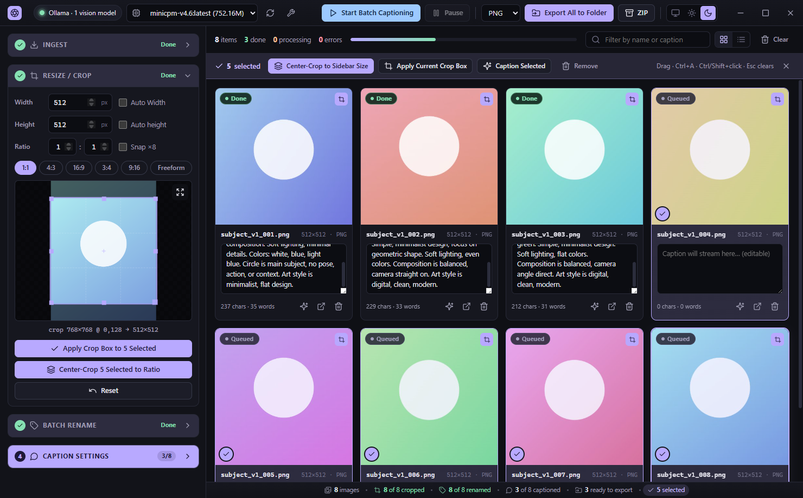
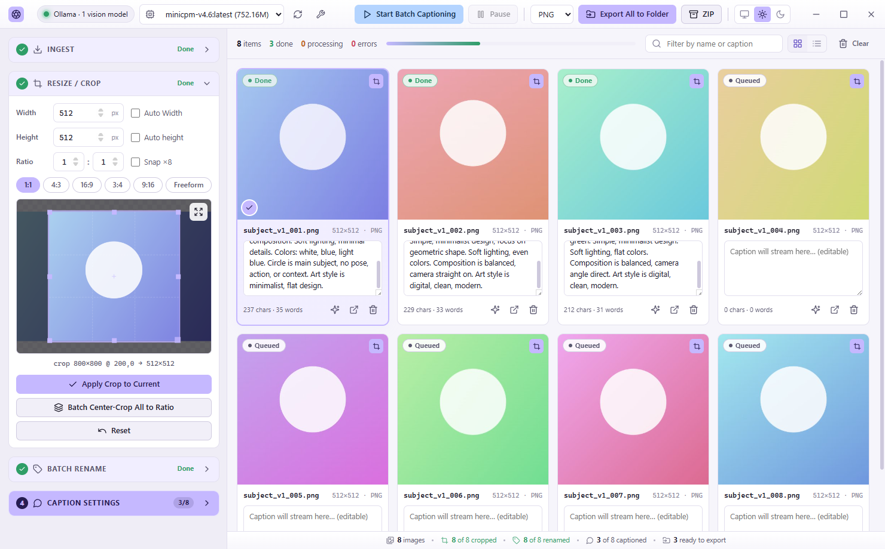
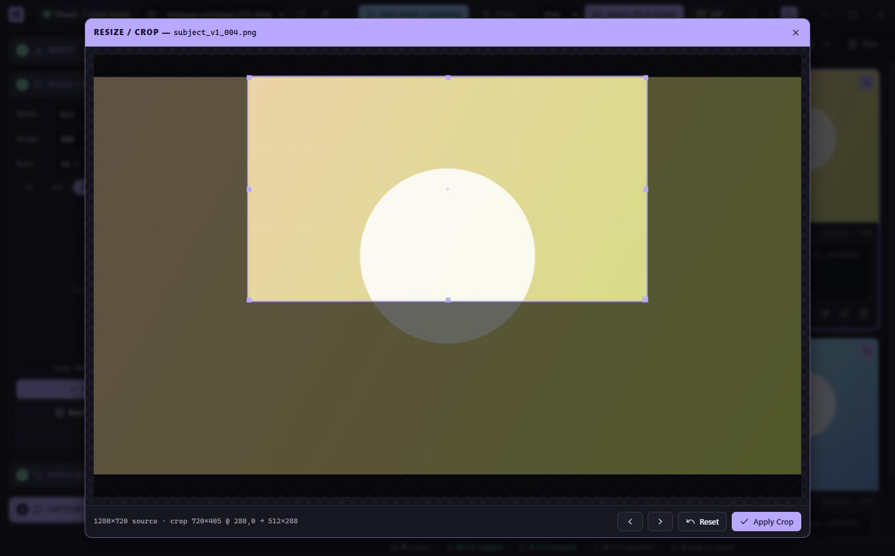
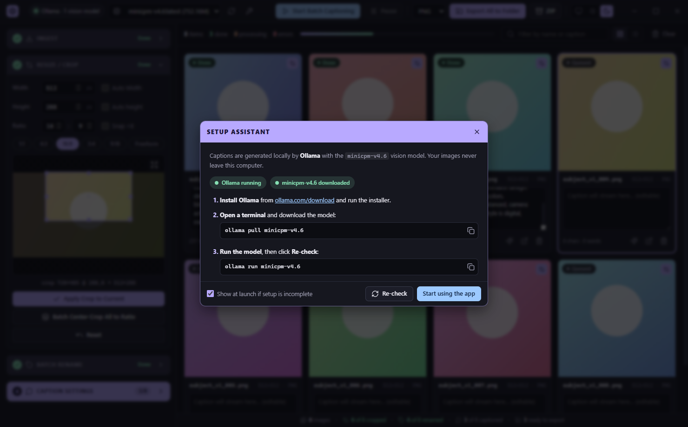

<div align="center">



# LoRA Dataset Studio

**A desktop app for building diffusion / LoRA training datasets: ingest, crop, rename and caption images with a local vision model, then export image + `.txt` caption pairs.**




</div>

---

## Download the electron App: https://github.com/calluxpore/LoRA-Dataset-Studio/releases/tag/1.3.0

---

## Features

- **Fast ingestion:** add single files, whole folders (scanned recursively), webcam snapshots, or drag and drop files and folders from Explorer or Finder. Supports JPG, PNG, WEBP and BMP.
- **Interactive cropping:** a Cropper.js editor in the sidebar plus a large crop window, with ratio presets (1:1, 4:3, 16:9, 3:4, 9:16, Freeform), fixed or automatic width and height, and optional snapping to multiples of 8.
- **Bulk operations:** select images with a drag box, **Ctrl+A** or **Ctrl/Shift+click**, then center-crop them all to your target size, copy one crop box onto every selected image, caption them, or remove them.
- **Local AI captions:** captions stream in word by word from a local [Ollama](https://ollama.com) vision model (default [`minicpm-v4.6`](https://ollama.com/library/minicpm-v4.6)). You can edit them at any time, and there's a trigger-word prefix, a custom prompt, a temperature setting, and one-click **Character / Style / Object / General** prompt presets. **Your images never leave your computer.**
- **Batch sequencer:** start, pause or resume captioning. It skips images that already have a caption and has per-image regenerate and stop buttons.
- **Batch rename:** `prefix_001`, `prefix_002`, … with a live preview.
- **Export:** paired `name.png|jpg` and `name.txt` files written straight to a folder or packed into a single ZIP. You get an OS notification and an *Open Folder* shortcut when it finishes.
- **Setup Assistant:** shows whether Ollama is running and the model is downloaded, with three short steps (install Ollama, pull the model, run it) and copyable commands.
- **Guided workflow:** the sidebar panels are numbered steps (Ingest → Resize / Crop → Rename → Caption). Steps still to do are highlighted and finished ones fade with a ✓. A status bar at the bottom summarizes the dataset: images, cropped, renamed, captioned, failed, ready to export and selected.
- **Light, dark and system themes** in pastel colors, a borderless window, collapsible sidebar panels, and a grid or list view.

<table>
  <tr>
    <td></td>
    <td></td>
  </tr>
  <tr>
    <td align="center"><sub>Bulk-crop a selection to the sidebar size</sub></td>
    <td align="center"><sub>Light mode</sub></td>
  </tr>
  <tr>
    <td></td>
    <td></td>
  </tr>
  <tr>
    <td align="center"><sub>Large crop editor</sub></td>
    <td align="center"><sub>Setup Assistant</sub></td>
  </tr>
</table>

## Download

Get the latest build from the **Releases** page:

| Platform | File |
| --- | --- |
| Windows (installer) | `LoRA Dataset Studio-Setup-<version>.exe` |
| Windows (portable, no install) | `LoRA Dataset Studio-Portable-<version>.exe` |

> [!NOTE]
> The builds aren't code-signed, so Windows SmartScreen may show *"Windows protected your PC"*. Click **More info → Run anyway**. For macOS and Linux, [build from source](#build-from-source).

On first launch, if Ollama or the model is missing, the **Setup Assistant** shows the steps to install them:

1. Install Ollama from [ollama.com/download](https://ollama.com/download).
2. Open a terminal and run `ollama pull minicpm-v4.6`.
3. Run `ollama run minicpm-v4.6`, then click **Re-check**.

## Requirements

- [Ollama](https://ollama.com/download) running locally (default `http://localhost:11434`)
- A vision model. The default is `minicpm-v4.6` (about 1.6 GB):

  ```bash
  ollama pull minicpm-v4.6
  ```

  Any other Ollama model with the `vision` capability also works. Pick it from the model dropdown in the title bar.

The app talks to Ollama from the Electron main process, so you **don't** need to set `OLLAMA_ORIGINS`.

## Usage

1. **Ingest:** click *Select Files* or *Select Directory*, turn on the webcam, or drop files or folders anywhere on the window.
2. **Resize / Crop:** set **Width**, **Height** and **Ratio** in the amber *RESIZE / CROP* panel.
   - To crop everything: press **Ctrl+A**, then click **Center-Crop N Selected to Ratio**.
   - To crop one image: select it, adjust the box, then click **Apply Crop to Current**. Click a thumbnail to open the large editor.
   - To reuse one framing: position the box on one image, select several, then click **Apply Crop Box to N Selected**.
3. **Rename:** enter a prefix, start index and zero padding, then click **Apply Batch Rename**.
4. **Caption:** in *Caption Settings*, pick the preset that matches your LoRA. Each one sets the prompt, temperature and send size:

   | Preset | Use for | What the caption leaves out | Temp | Send size |
   | --- | --- | --- | --- | --- |
   | **Character** | A person or character | Face, hair, eyes, body | 0.2 | 1024 |
   | **Style** | An art style | Style, medium, colors | 0.3 | 896 |
   | **Object** | A product or object | The object's own look | 0.15 | 1024 |
   | **General** | Fine-tunes, Flux/SD3 | Nothing, describes everything | 0.25 | 1024 |

   Whatever the caption leaves out is what your trigger word learns. Put the trigger word in *Trigger word / caption prefix*. Then click **Start Batch Captioning**. Edit captions directly in each card, and use ✦ to regenerate one.
5. **Export:** choose PNG or JPG, then **Export All to Folder** or **ZIP**.

**How export sizes work:**
- Uncropped images are exported at their original resolution.
- If the crop box's aspect ratio doesn't match the target W×H, the crop is trimmed evenly from the edges, so images are **never stretched**.

### Keyboard shortcuts

| Shortcut | Action |
| --- | --- |
| `Ctrl` + `A` | Select all visible images |
| `Ctrl` + click / `Shift` + click | Toggle one image / select a range |
| Drag on empty queue space | Box selection (hold `Ctrl` to add to the selection) |
| `Esc` | Clear selection / close dialog |
| `Delete` | Remove selected images |
| `Ctrl` + `Enter` | Start batch captioning |
| `←` / `→` (crop editor) | Previous / next image |
| `Enter` (crop editor) | Apply crop |

## Build from source

```bash
git clone <repo-url>
cd lora-dataset-studio
npm install
npm start          # run in development
```

Package it with [electron-builder](https://www.electron.build/). Output goes to `dist/`:

```bash
npm run dist:win     # NSIS installer + portable .exe
npm run dist:mac     # .dmg (run on macOS)
npm run dist:linux   # AppImage
```

> [!TIP]
> If `npm start` fails with *"Electron failed to install correctly"*, npm skipped or couldn't finish the Electron binary download. This is common inside synced folders like OneDrive. Run `node node_modules/electron/install.js`. If that still fails, extract the zip from `%LOCALAPPDATA%\electron\Cache` (Windows) into `node_modules/electron/dist` and write `electron.exe` into `node_modules/electron/path.txt`.

## Project structure

```
├── main.js             # Main process: window, dialogs, file I/O, Ollama streaming proxy, export (JSZip), theme
├── preload.js          # contextBridge → window.electronAPI
├── renderer/
│   ├── index.html      # Layout, dialogs, card template
│   ├── style.css       # Theme tokens (light/dark) and components
│   ├── app.js          # UI state, Cropper.js, ingestion, selection, batch sequencer, export
│   ├── setup.js        # Setup Assistant UI
│   └── icons.js        # Inline Lucide-style SVG icons
├── build/icon.png      # App icon used by electron-builder
└── docs/screenshots/   # README images
```

**Architecture notes**

- **Security:** the renderer runs with `contextIsolation: true`, `sandbox: true` and `nodeIntegration: false`, behind a strict CSP. Every file-system and network call goes through a small IPC API exposed in `preload.js`.
- **Streaming captions:** `/api/generate` is called with `stream: true`, and each NDJSON line is forwarded to the renderer as a `caption-token` event. For models that report the `thinking` capability, `think: false` is sent so captions start right away.
- **Image processing:** crop and resize are done with `createImageBitmap` (high-quality resampling) and canvas encoding, so there's no native `sharp` dependency.
- **Storage:** settings are kept in `localStorage`. The theme is kept in `userData/preferences.json` so it applies before the window paints.

## Troubleshooting

| Problem | Fix |
| --- | --- |
| "Ollama Offline" banner | Start Ollama (open the Ollama app, or run `ollama run minicpm-v4.6` in a terminal), then click **Re-check** in the Setup Assistant (🔧 in the title bar). |
| "Model not downloaded" | Run `ollama pull minicpm-v4.6` in a terminal, then click **Re-check**. |
| Ollama runs on another machine | Change **Ollama host** in *Caption Settings*, for example `http://192.168.1.20:11434`. |
| Captions are slow | Lower *Send size (px)* in *Caption Settings*. Images are downscaled before they're sent to the model. |
| Webcam doesn't start | Allow camera access for the app in your OS privacy settings. |

## Tech stack

[Electron](https://www.electronjs.org/) · [Cropper.js](https://github.com/fengyuanchen/cropperjs) · [JSZip](https://stuk.github.io/jszip/) · [Ollama](https://ollama.com) · [Lucide](https://lucide.dev/) icons · [electron-builder](https://www.electron.build/)

## License

[MIT](LICENSE)
